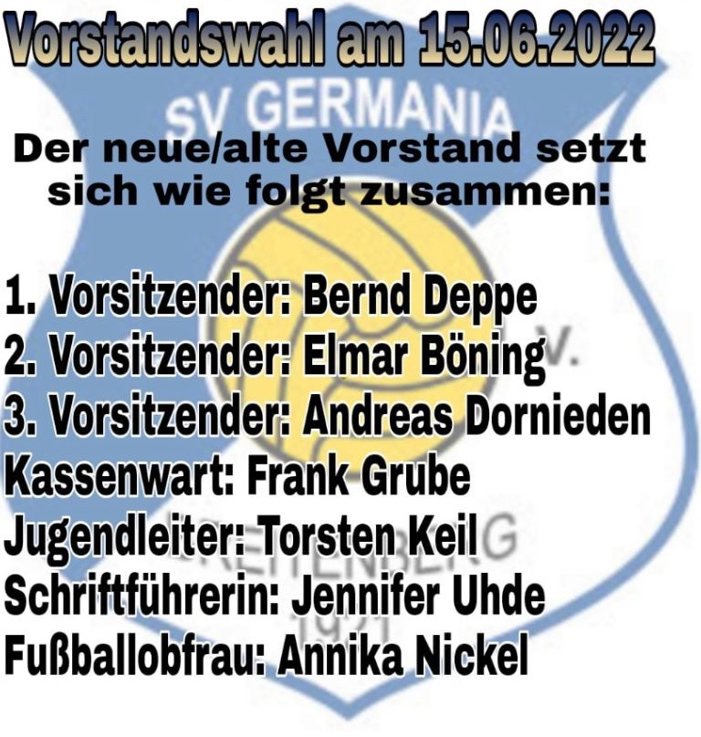

## SV GERMANIA
{: style="text-align: left;"}

Am 15.06.2022 fand die Jahreshauptversammlung am Sporthaus statt. Bis auf den 1. Vorsitzenden und den Kassenwart wurden alle Posten neu vergeben bzw. durch Wiederwahl gleich besetzt. 
Wir bedanken uns recht herzlich bei unseren ausgeschiedenen Vorstandsmitgliedern Daniel Conrady, Niklas Nolte und Mario Deppe für ihre geleistete Arbeit.
{: style="text-align: left;"}

 
 

Der Verein unterhält Sportgruppen in den Sportarten:
{: style="text-align: left;"}

- Fussball
- Gymnastik
- Tischtennis 
{: style="text-align: left;"}

 
 

## Männergesangverein Liederkranz
{: style="text-align: left;"}

- Vorsitzender: Aloys Friedrich
- Derigent: Matthias Noltes
{: style="text-align: left;"}

## Feuerwehrverein Breitenberg e.V.
{: style="text-align: left;"}

Infos folgen.
{: style="text-align: left;"}

## Heimat- und Kulturverein Breitenberg
{: style="text-align: left;"}

Infos folgen.
{: style="text-align: left;"}

## Katholische Frauengemeinschaft

Infos folgen.
{: style="text-align: left;"}

## Fehlt Euer Verein?
{: style="text-align: left;"}

Bei Bedarf gebt bitte aktuelle Informationen zu euerem Verein über den Ortsrat Breitenberg weiter oder kontaktiert den Internetbeauftragten direkt über Whatsup.
{: style="text-align: left;"}