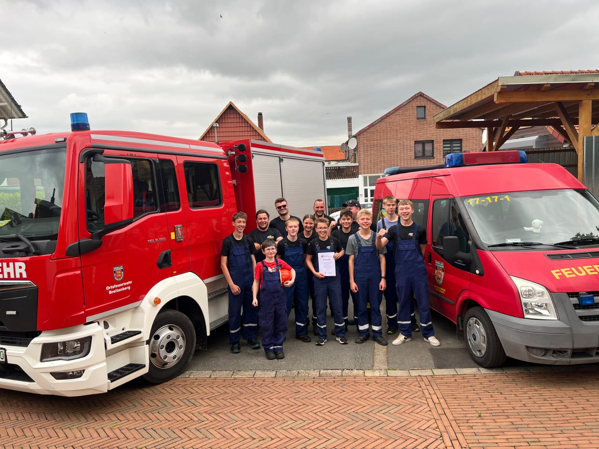
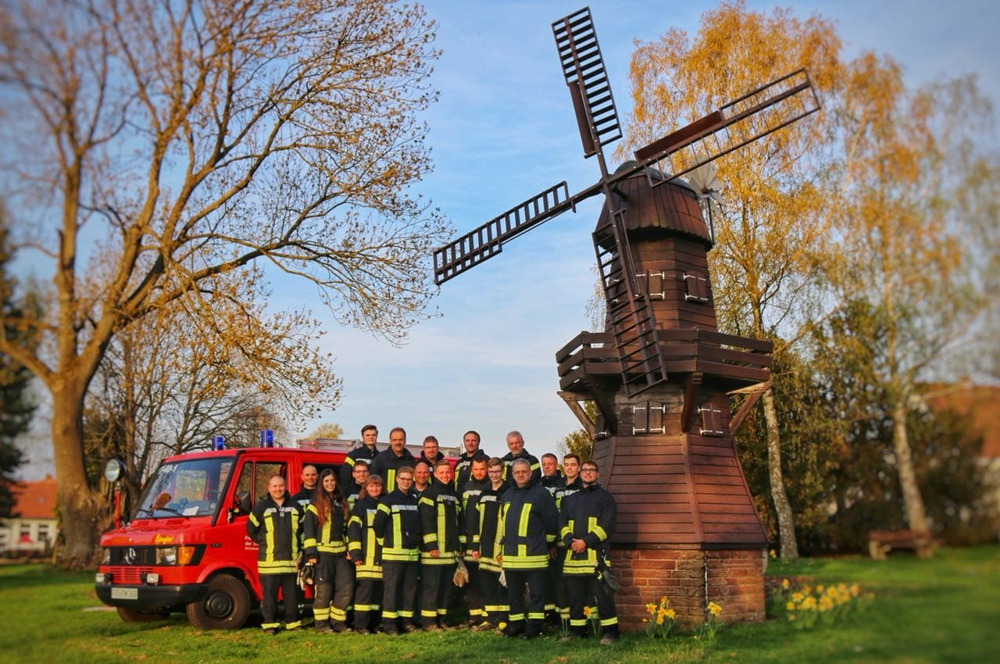

### Am 15. Juni 2025 hat unsere Ortsfeuerwehr bei den Kreisjugendwettbewerben des Landkreises Göttingen den 9. Platz belegt und sich damit für die Bezirksjugendwettbewerbe in Gifhorn am 29. Juni qualifiziert. Herzlichen Glückwunsch!

 

 

Im Jahr 2014 taten sich 20 Breitenberger zusammen, um den Feuerwehrverein Breitenberg e.V. zu gründen, um damit die Freiwillige Feuerwehr Breitenberg zu unterstützen. Mittlerweile ist die Anzahl der Mitglieder des Feuerwehrvereins Breitenberg e.V. auf über 70 Mitgliedern gestiegen.

Über weitere Mitglieder die sich im Feuerwehrverein engagieren und diesen unterstützen wollen, würden wir uns sehr freuen. Der Jahresbeitrag beträgt nur 12 €.

Falls Interesse an einer Mitgliedschaft im Feuerwehrverein Breitenberg besteht, steht unten die Beitrittserklärung als PDF-Datei zum Download zur Verfügung. Bitte senden Sie dieses Formular ausgefüllt und unterschrieben per E-Mail an feuerwehrverein@feuerwehr-breitenberg.de oder geben Sie die Anmeldung beim 1. Vorsitzenden Matthias Nolte, Hakenbergstraße 2, 37115 Duderstadt OT Breitenberg ab.

### Vorstand

| 1. Vorsitzender  | Matthias Nolte     |
| ---------------- | ------------------ |
| 2. Vorsitzender  | Tobias Schmalstieg |
| Ortsbrandmeister | Julián Nolte       |
| Kassenwartin     | Nicole Schmalstieg |
| Schriftführer    | Jörg Nolte         |
| 1. Beisitzer     | Mike Nolte         |
| 2. Beisitzer     | Nicola Ehrich      |

### Links 

- zur Webseite [https://www.feuerwehr-breitenberg.de/](https://www.feuerwehr-breitenberg.de/)
- 
Link zur <a href="https://www.facebook.com/profile.php?id=100064547268537&locale=de_DE" class="icon brands fa-facebook-f">acebook</a> Seite des Feuerwehrvereins Breitenberg e.V.
