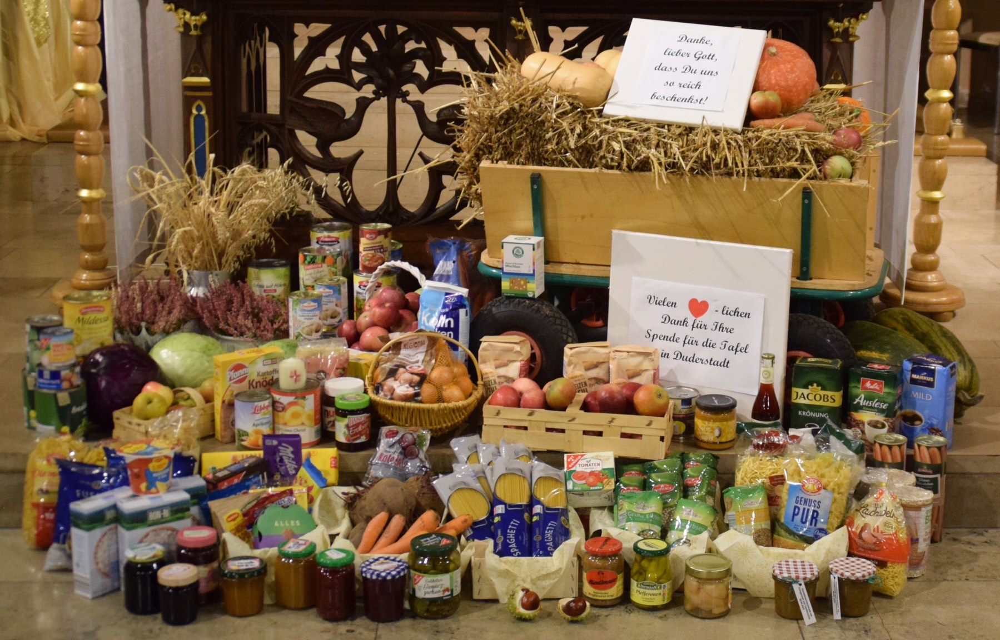

<section id="main" class="container">

<section class="box special">
    <header class="major">
    </header>
    
</section>

<!-- awesome font icons look at https://github.com/FortAwesome/Font-Awesome/tree/master/svgs/solid -->

<h1> wichtige Termine in Breitenberg </h1>

{% assign yesterday = 'now' | date: '%s' | minus:'86400' | times: 1 %}



    {% assign termin_date = item.date | date: '%s' | times: 1 %}
    

<section class="box special features">
    

        <section>
            
            <h3>{{ item.date }}</h3>
            <h4>{{ item.time }}</h4>
        </section>
        <section>
            
            <h3>{{ item.title }}</h3>
            {{ item.fleyer }}
        </section>
    

    

        <section>
            
            <h3>{{ item.location }}</h3>
        </section>
        <section>
            
            <h3 style="text-align: left;">{{ item.text | markdownify }}</h3>
        </section>
    

</section>

    


</section>
