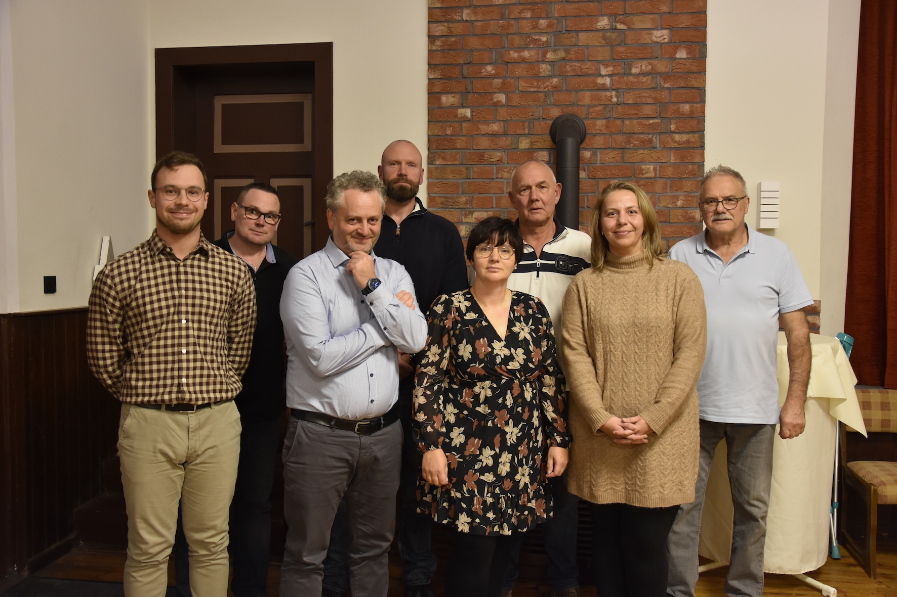

Foto: Marie Stollberg
 

Am Donnerstag den 30. Oktober 2025 wurde innerhalb des Ortsrates unser neuer Bürgermeister gewählt und die Aufgaben der Ortsratsmitglieder beschlossen.

<h3>Bürgermeister: Andreas Dornieden </h3>

1.⁠ ⁠Stellv. Gregor Wippermann  
2.⁠ ⁠Stellv. Mario Deppe  
Fraktionsvorsitzender: Claudio Pizzano   

Seniorenobleute:  
Andreas Dornieden   
Anke Gerbode  
Kordula  Wippermann   

Jugendbeauftragter:  
Louis Schmalstieg   
Luca Eckermann   

Ortsjugendpfleger:  
Linus Exkermann  
Marlon und Celine Rudolph   

