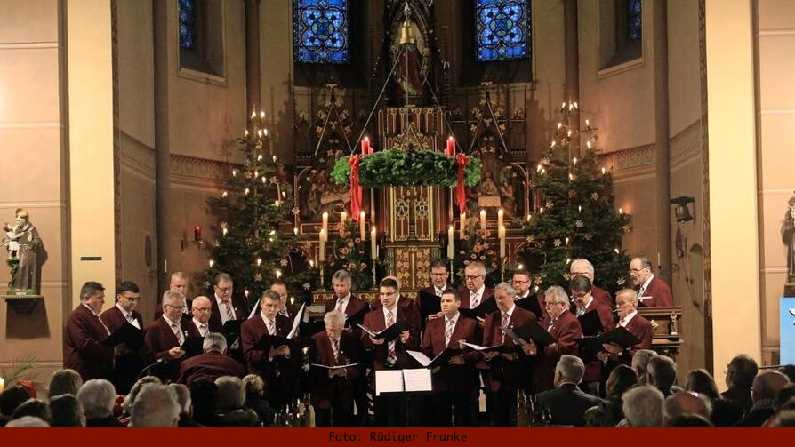

- Vorsitzender: Aloys Friedrich
- Dirigent: Matthias Nolte

Die Proben finden vorwiegend in der kälteren Jahreszeit immer Montags um 20 Uhr im PGH statt. Neue Sänger sind immer gern willkommen. Für Getränke ist gesorgt!
