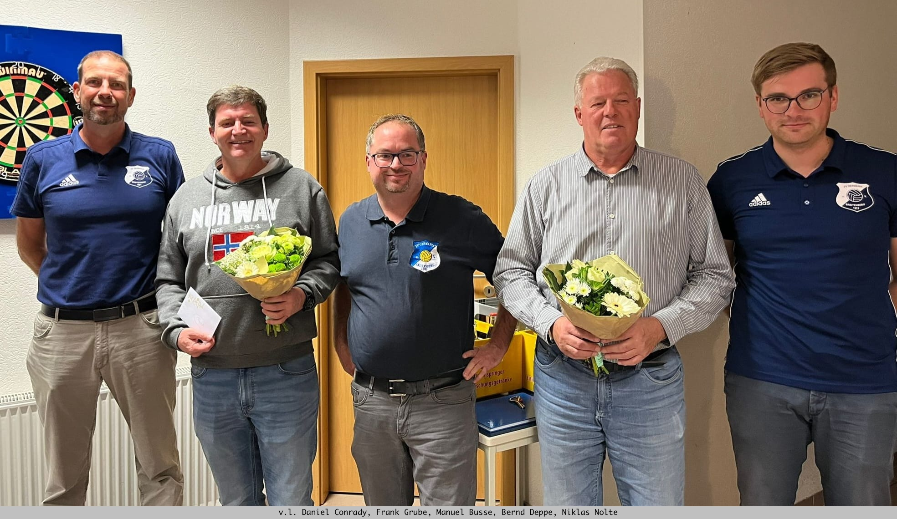
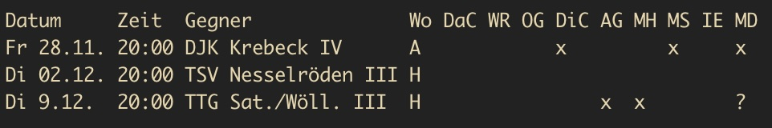
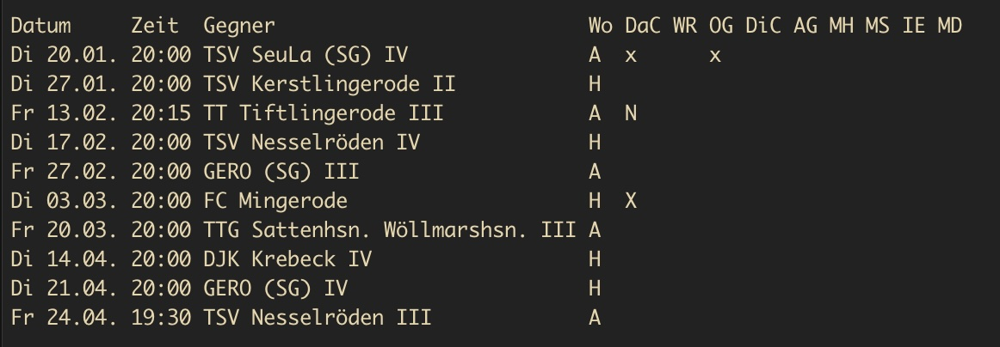

Am gestrigen Dienstag stand die Jahreshauptversammlung unseres SV Germania an, die seit Jahren mal wieder sehr gut besucht war! 👌🏻

Einer der wichtigsten Punkte war die Wahl eines neuen Vorstandes. Durch Änderung der Satzung wird es ab sofort einen geschäftsführenden Vorstand geben, der von einzelnen Spartenleitern unterstützt wird - somit den Gesamtvorstand bildet. Der geschäftsführende Vorstand besteht aus Manuel Busse, Daniel Conrady und Niklas Nolte - viel Erfolg in euren Vorhaben! ✊🏻							

Ein neuer Vorstand bedeutet allerdings auch, dass zwei wichtige Mitglieder ihr Amt zur Verfügung gestellt haben. In unserem Fall sind das Bernd Deppe, der jahrelang unser 1. Vorsitzender (Präsi)  war und auch schon vorher in unterschiedlichen Funktionen im Vorstand und Verein tätig war. Außerdem Frank Grube,  der zuletzt als Kassenwart fungierte, aber auch in anderen Bereichen sehr aktiv mitgewirkt hat. Beiden sagen wir DANKE für den unermüdlichen Einsatz im Verein und für den Verein!

| Aufgabenbereich                           | Person(en)                                    |
| ----------------------------------------- | --------------------------------------------- |
| Geschäftsführender Vorstand               | Manuel Busse, Daniel Conrady und Niklas Nolte |
| Spartenleiter - Kasse                     | Mario Deppe                                   |
| Spartenleiter - Sportanlagen Organisation | Torsten Keil                                  |
| Spartenleiter - Damenfußball              | Annika Nickel                                 |
| Spartenleiter - Tischtennis               | Joachim Nolte                                 |
| Spartenleiter - Fitness                   | Katharina Wucherpfennig                       |
| Spartenleiter - Events                    | Dennis Dornieden                              |

Link zur <a href="https://www.facebook.com/profile.php?id=100063576277509" class="icon brands fa-facebook-f">acebook</a> Seite des SV Germania Breitenberg

   

## Belegungsplan der Sporthalle

| Uhrzeit       | Montag                    | Dienstag    | Mittwoch         | Donnerstag        | Freitag     |
| ------------- | ------------------------- | ----------- | ---------------- | ----------------- | ----------- |
| 16:30 - 17:30 | -                         | -           | -                | -                 | JFV         |
| 17:00 - 17:45 | Senioren Männer Gymnastik | -           | -                | -                 | -"-         |
| 17:45 - 18:00 | -"-                       | -           | Frauen Gymnastik | -                 | -"-         |
| 18:00 - 19:00 | Senioren Frauen Gymnastik | Tischtennis | -"-              | -                 | Tischtennis |
| 19:00 - 20:00 | Frauen Gymnastik          | -"-         | -"-              | Damenmannschaft * | -"-         |
| 20:00 - 21:00 | -"-                       | -"-         | -                | -"-               | -"-         |
| 21:00 - 23:00 | -                         | -"-         | -                | -"-               | -"-         |

'*' ab Ende November

Ansprechpartner:  
<ul>
    <li>Senioren Gymnastik: Angelika Riethof</li>
    <li>Frauen Gymnastik: Katharina Wucherpfennig</li>
    <li>Tischtennis: Joachim Nolte</li>
</ul>

## Tischtennis

   

### Spiele TT SG Bergdörfer IV 2025/2026 {#tt-4}

  

Spiele bei denen jetzt schon klar ist, dass 5 Leute fehlen, sind mit * gekennzeichnet und werden nach Möglichkeit verlegt.

#### Hinrunde - 2025: {#tt-4-h}

<!--
https://tableconvert.com/markdown-to-json
echo '' && mlr --ijson --opprint cat iv-tt.json | tr - ' ' && echo ""
bild daraus machen
 -->

 

 

Legende:

- x oder X = nicht verfügbar
- K = krank
- N = spielt nur im absoluten Notfall
- m = möchte gerne bei dieser Begegnung spielen
- A / H in Spalte "Wo": auswärtz / heim

#### Rückrunde - 2026:

<!--
https://tableconvert.com/markdown-to-json
echo '' && mlr --ijson --opprint cat iv-tt-rr.json | tr - ' ' && echo ""
bild daraus machen
 -->

 

 

