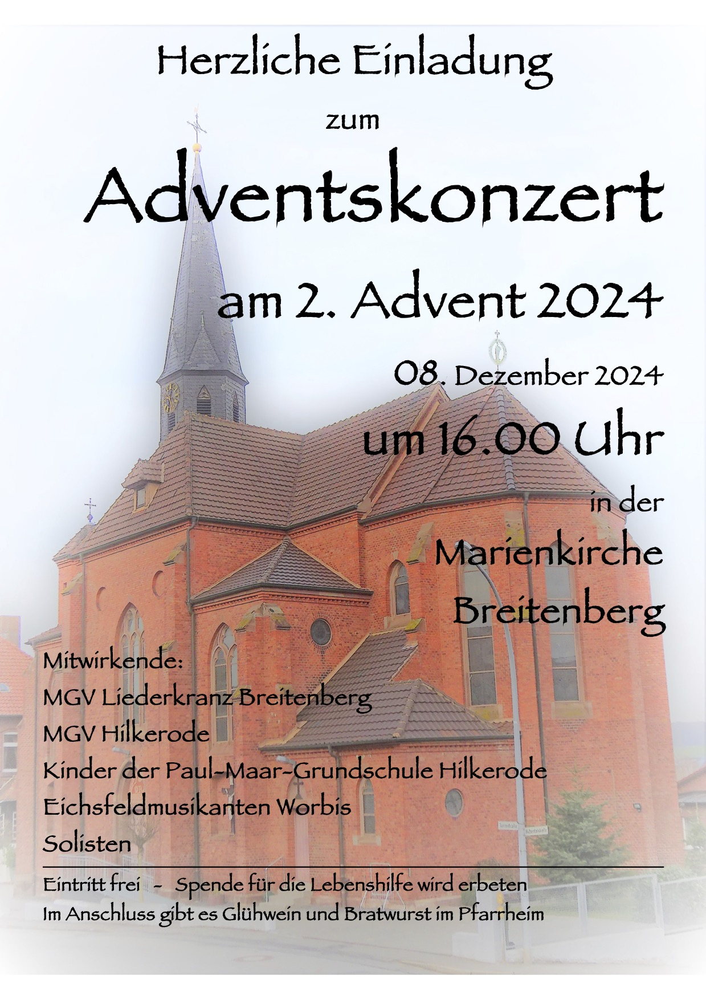
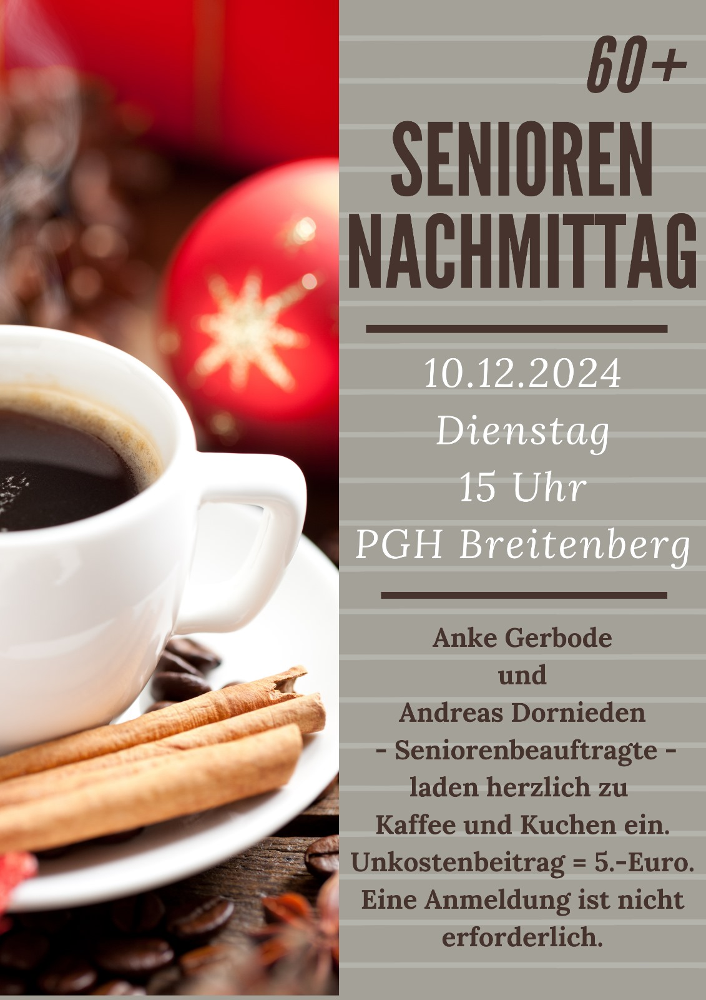
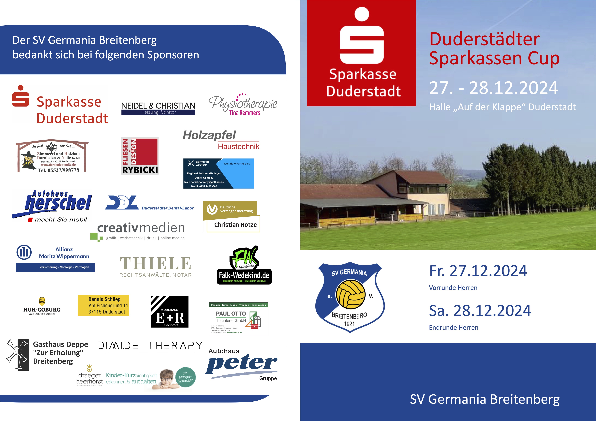

<!-- aktuell wurden keine Termine an den Internetverantwortlichen gemeldet. -->

<!--
    <article class="box post post-excerpt">
        <header class="major">
        <h2>17.11.2024 - Gedenkveranstaltung zum Volkstrauertag um 11:00 Uhr vor dem Denkmal</h2>
        

        

        </header>
    </article>
-->

<!--   -->

 

 

<article class="box post post-excerpt">
    <header class="major">
    <h2>Termine für 2025</h2>
    

    

    </header>
</article>

| Datum                   | Thema                     | Verein          | Ort             |
| ----------------------- | ------------------------- | --------------- | --------------- |
| 14.01.2025              | Feierabendgespräch        | Ortsrat         | DGH             |
| 01.03.2025              | Faschingsball             | Feuerwehr       | Deppe           |
| 15.03.2025              | Apres Ski Party           | SVG             | Sportplatz      |
| 22.03.2025              | Frühjahrsputz             | Ortsrat         | Dorfplatz       |
| 29.03.2025              | Boßeln                    |                 | Kyffhäuser      |
| 12.04.2025              | Vogelschießen             | Kyffhäuser      | Kyffhäuser      |
| 19.04.2025              | Eiersuchen für die Kinder | Ortsrat         | Dorfplatz       |
| 20.04.2025              | Osterfeuer                | Feuerwehr / SVG | Sportplatz      |
| 15.05.2025              | Feierabendgespräch        | Ortsrat         | Dorfplatz / DGH |
| 31.05.2025 - 01.06.2025 | Schützenfest              | Kyffhäuser      | Dorfplatz       |
| 20.06. oder 27.06.2025  | Wikinger Schach           | SVG             | Sportplatz      |
| 02.08.2025 - 03.08.2025 | Sportfest                 | SVG             | Sportplatz      |
| 30.08.2025              | Weinwiesn                 |                 | Dorfplatz       |
| 15.10.2025              | Feierabendgespräch        | Ortsrat         | Dorfplatz / DGH |
| 25.10.2025              | BoBeln                    |                 | Kyffhäuser      |
| 31.10.2025              | Halloween                 | Kyffhäuser      | Kyffhäuser      |
| 15.11.2025              | Sankt Martin              | Feuerwehr       | Dorfplatz       |
| 29.11.2025              | Weihnachtsmarkt           |                 | Dorfplatz       |
| 27.12.2025              | Hallentunier              | SVG             | Auf der Klappe  |

    

Bitte informiert Euch auch über die Whatsapp Bürgergruppe über anstehende Termin. Gruppen-Admin ist u.a. unsere Bürgermeisterin Katja Neumann.

Für alle, die Termine hier bekanntgegeben haben wollen, sendet bitte entsprechende Informationen an Oliver Gaida. Bilder oder PDF-Dateien bitte im Original versenden. Texte bitte als Text in einer Textdatei, im Chat oder in einer Email senden. Wenn Fotos mit Personen veröffentlicht werden sollen, klärt bitte vorher das Einverständnis ab.

