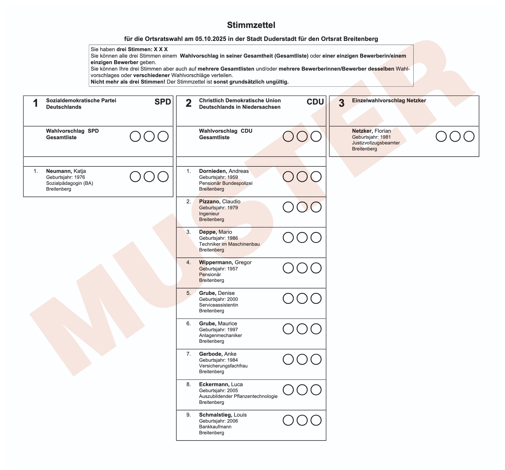
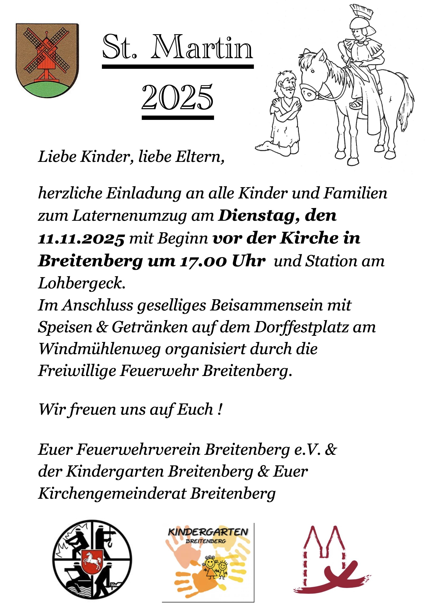
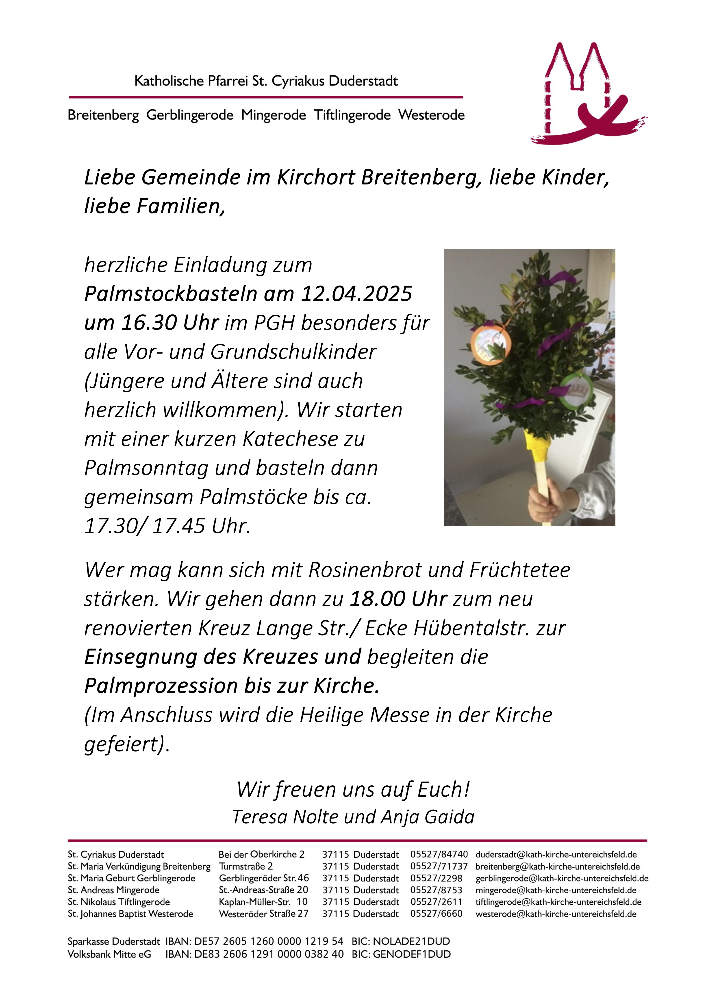
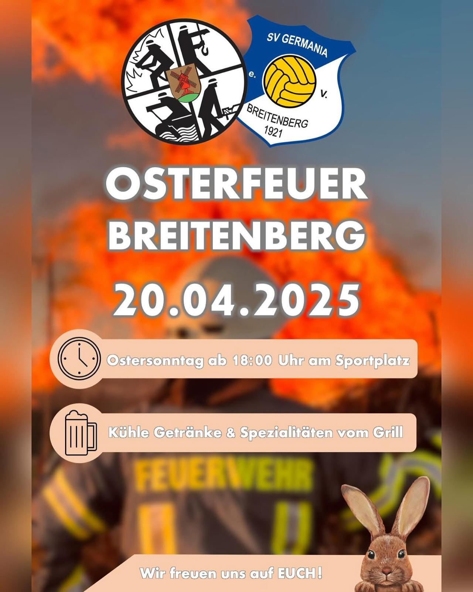

<!-- aktuell wurden keine Termine an den Internetverantwortlichen gemeldet. -->

<!--<article class="box post post-excerpt">
    <header class="major">
    <h3>5. Oktober 2025 - Neuwahl des Ortsrates Breitenberg im Pfarrgemeindehaus</h3>
    

    

    </header>

<h1 id=stimmzettel> Unser Stimmzettel morgen (Muster):</h1>
  

 
Quelle: <a href="https://www.duderstadt.de/portal/seiten/neuwahl-ortsrat-breitenberg-900000425-25420.html">https://www.duderstadt.de/portal/seiten/neuwahl-ortsrat-breitenberg-900000425-25420.html</a>

 

 
 

</article>
-->

| Datum  | Thema                               | Verein     | Ort                                 |
| ------ | ----------------------------------- | ---------- | ----------------------------------- |
| 29.11. | Weihnachtsmarkt                     |            | Dorfplatz                           |
| 27.12. | Hallentunier                        | SVG        | Sporthalle - Auf der Klappe         |

<!--
  

 

 
-->

<!--

 

 

 

 
-->

  

Bitte informiert Euch auch über die Whatsapp Bürgergruppe über anstehende Termine. Gruppen-Admin ist u.a. unsere Bürgermeisterin Katja Neumann.

Für alle, die Termine hier bekanntgegeben haben wollen, sendet bitte entsprechende Informationen an Oliver Gaida. Bilder oder PDF-Dateien bitte im Original versenden. Texte bitte als Text in einer Textdatei, im Chat oder in einer Email senden. Wenn Fotos mit Personen veröffentlicht werden sollen, klärt bitte vorher das Einverständnis ab.

