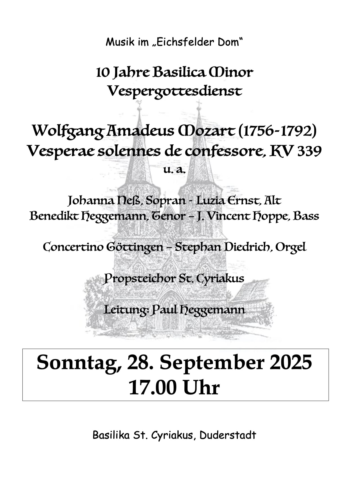
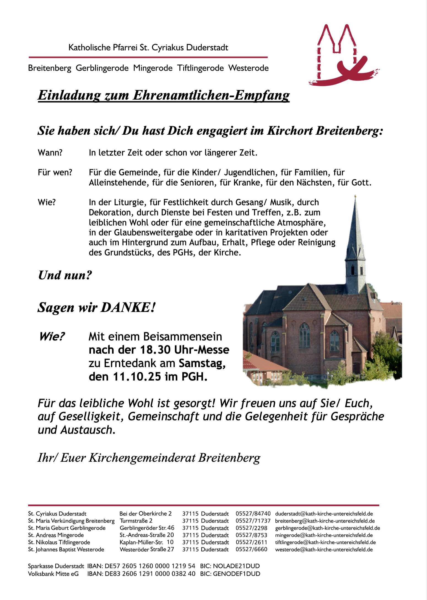

<!-- aktuell wurden keine Termine an den Internetverantwortlichen gemeldet. -->

<article class="box post post-excerpt">
    <header class="major">
        <h2>Termine für 2025</h2>
    </header>
</article>

| Datum      | Thema                               | Verein     | Ort                                 |
| ---------- | ----------------------------------- | ---------- | ----------------------------------- |
| 05.10.2025 | Neuwahl des Breitenberger Ortsrates |            | Hübentalstr. 11 - Pfarrgemeindehaus |
| 25.10.2025 | Boßeln                              | HKV        | Kyffhäuser                          |
| 31.10.2025 | Halloween                           | Kyffhäuser | Kyffhäuser                          |
| 15.11.2025 | Sankt Martin                        | Feuerwehr  | Dorfplatz                           |
| 29.11.2025 | Weihnachtsmarkt                     |            | Dorfplatz                           |
| 27.12.2025 | Hallentunier                        | SVG        | Sporthalle - Auf der Klappe         |

  

<article class="box post post-excerpt">
    <header class="major">
    <h3>5. Oktober 2025 - Neuwahl des Ortsrates Breitenberg im Pfarrgemeindehaus</h3>
    

    

    </header>

Die Neuwahl des Ortsrates Breitenberg findet am 5. Oktober 2025 statt.

Der Ortsrat Breitenberg besteht nach § 4 Abs. 1 Nr. 1 der Hauptsatzung der Stadt Duderstadt aus neun Mitgliedern. Im Ortsrat Breitenberg waren bislang fünf Sitze besetzt. Durch den Sitzverzicht eines weiteren Ortsratsmitglieds ist die Anzahl der besetzten Sitze im Ortsrat auf vier gesunken. Dadurch sind mehr als die Hälfte der Sitze unbesetzt. Nach § 70 Abs. 1 Niedersächsisches Kommunalverfassungsgesetz (NKomVG) ist der Ortsrat damit aufgelöst. Die Kommunalaufsicht des Landkreises Göttingen hat die Auflösung festgestellt. Nach § 43 Abs. 1 NKWG findet die erforderliche Neuwahl spätestens vier Monate nach Auflösung des Ortsrates statt. Der Verwaltungsausschuss der Stadt Duderstadt hat als Termin für die Neuwahl des Ortsrates der Ortschaft Breitenberg Sonntag, den 5. Oktober 2025, bestimmt.

</article>

 

 

 

 

<!--

 

 

 

 
-->

  

Bitte informiert Euch auch über die Whatsapp Bürgergruppe über anstehende Termine. Gruppen-Admin ist u.a. unsere Bürgermeisterin Katja Neumann.

Für alle, die Termine hier bekanntgegeben haben wollen, sendet bitte entsprechende Informationen an Oliver Gaida. Bilder oder PDF-Dateien bitte im Original versenden. Texte bitte als Text in einer Textdatei, im Chat oder in einer Email senden. Wenn Fotos mit Personen veröffentlicht werden sollen, klärt bitte vorher das Einverständnis ab.

