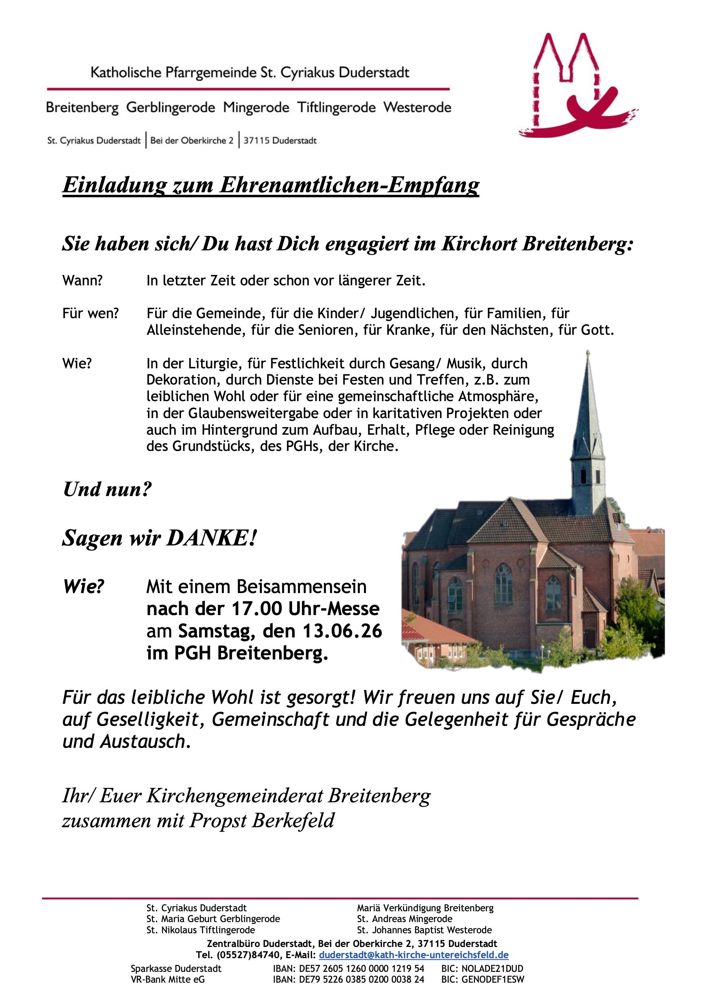
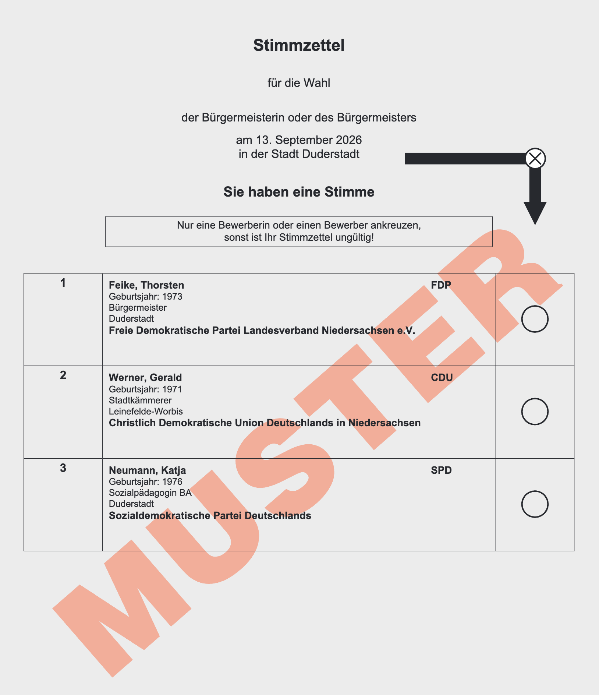
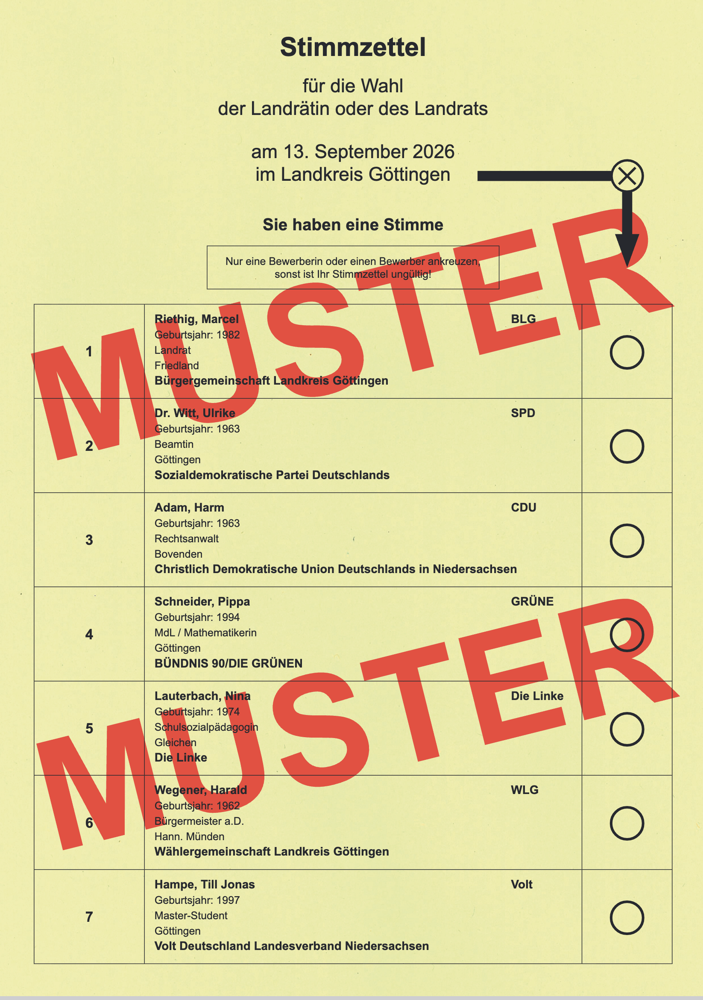
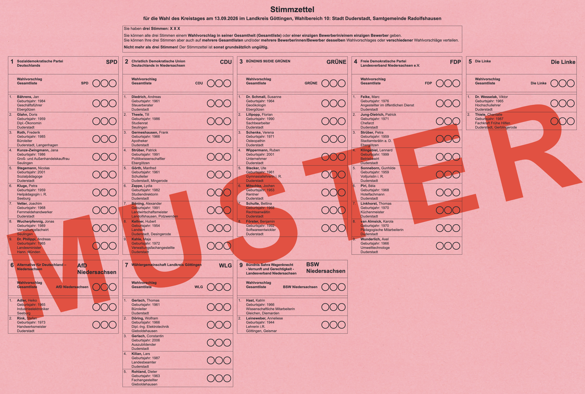
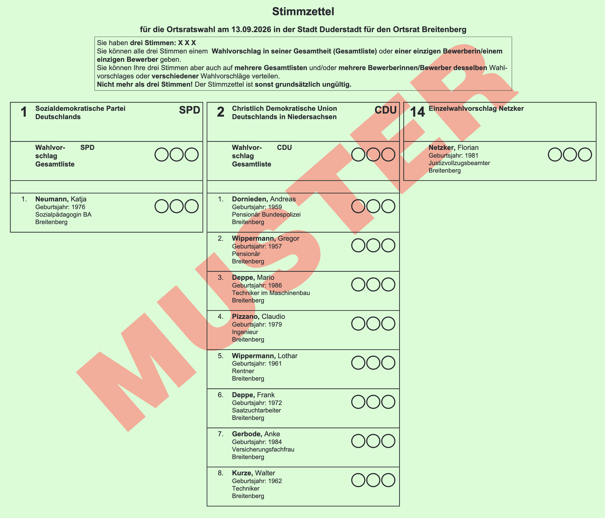
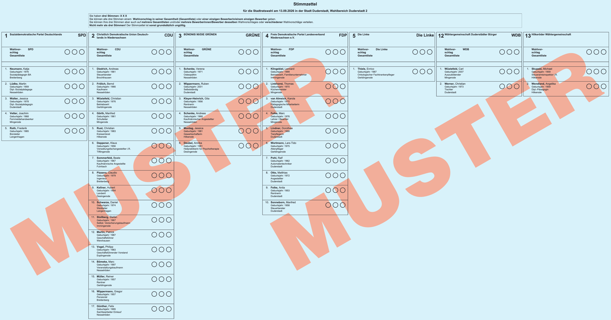
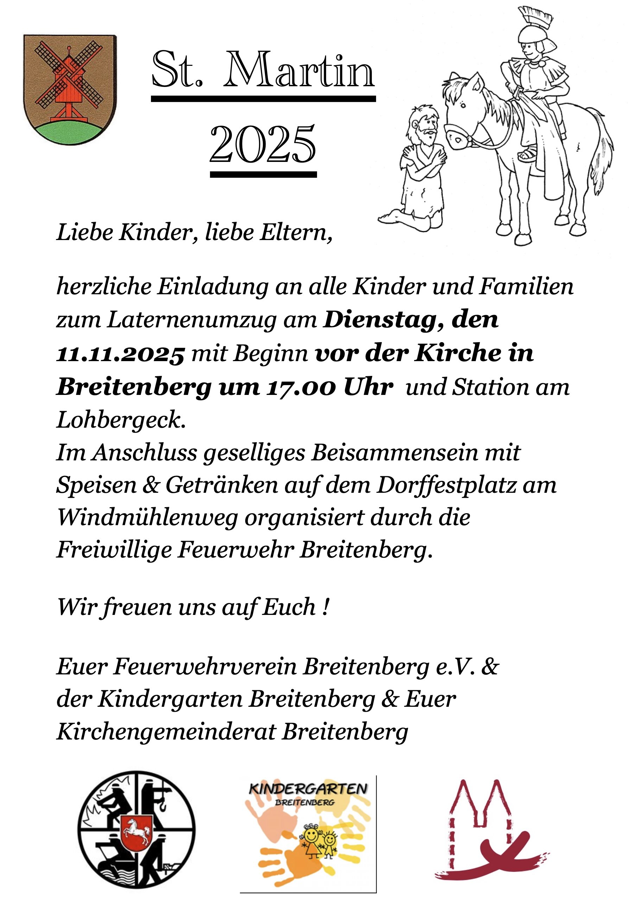
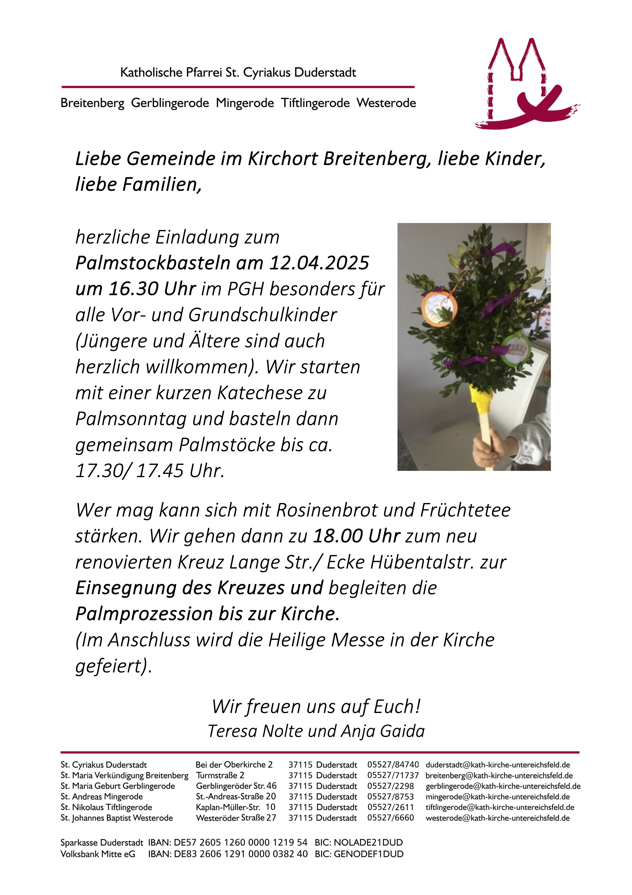
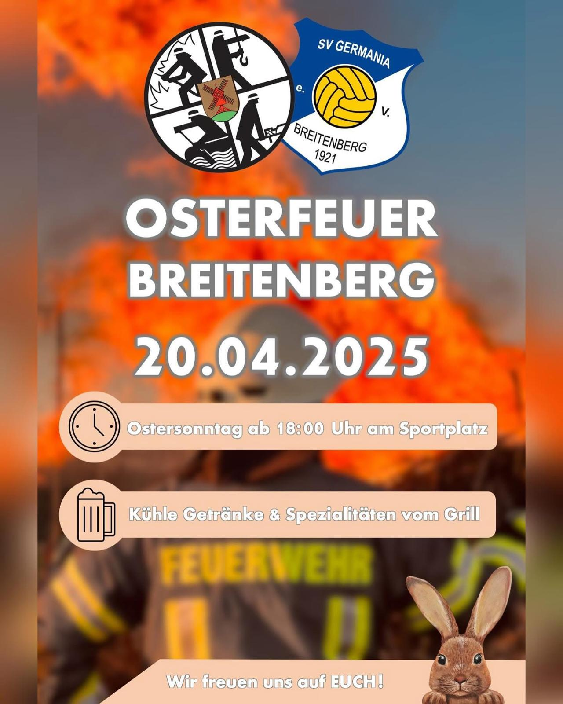

<!--
  

 

 aktuell wurden keine Termine an den Internetverantwortlichen gemeldet.

-->
<article class="box post post-excerpt">
    <header class="major">
    <h3>Wahlen am 13. Oktober 2026</h3>
    

    

    </header>

<h1 id=stimmzettel> 2 Stimmzettel mit je einer Stimme (Muster):</h1>
  
 
  
 

 
<h1 id=stimmzettel> 3 Stimmzettel mit je 3 Stimmen (Muster):</h1>
  
 
  
 
  
 

 

 
 

</article>

| Datum             | Thema                                              | Verein                | Ort                    |
| ----------------- | -------------------------------------------------- | --------------------- | ---------------------- |
| 10.10.            | Erntedankandacht 9:30 Uhr, 10 Uhr Frühstück        | Frauengemeinschaft    | Kirche / PGH           |
| 30.10. und 31.10. | Halloween, jeweils ab 16:00 Uhr                    | Kyffhäuser            | Kyffhäuser Vereinsheim |
| 11.11.            | Sankt Martin                                       |                       |                        |
| 15.11.            | Volkstrauertag mit Kranzniederlegung               | Kyffhäuser, MGV       | Denkmal                |
| 06.12.            | Adventssingen 16:00                                | MGV                   | Kirche / PGH           |
| 09.12.            | Weihnachtsfeier    18:30                           | Frauengemeinschaft    | PGH                    |
| 12.12.            | Weihnachtsmarkt                                    |                       | Dorfplatz              |

<!--  
  

 

 
-->

<!--

 

 

 

 
-->

  

Bitte informiert Euch auch über die Whatsapp Bürgergruppe über anstehende Termine.

Für alle, die Termine hier bekanntgegeben haben wollen, sendet bitte entsprechende Informationen an Oliver Gaida. Bilder oder PDF-Dateien bitte im Original versenden. Texte bitte als Text in einer Textdatei, im Chat oder in einer Email senden. Wenn Fotos mit Personen veröffentlicht werden sollen, klärt bitte vorher das Einverständnis ab.

